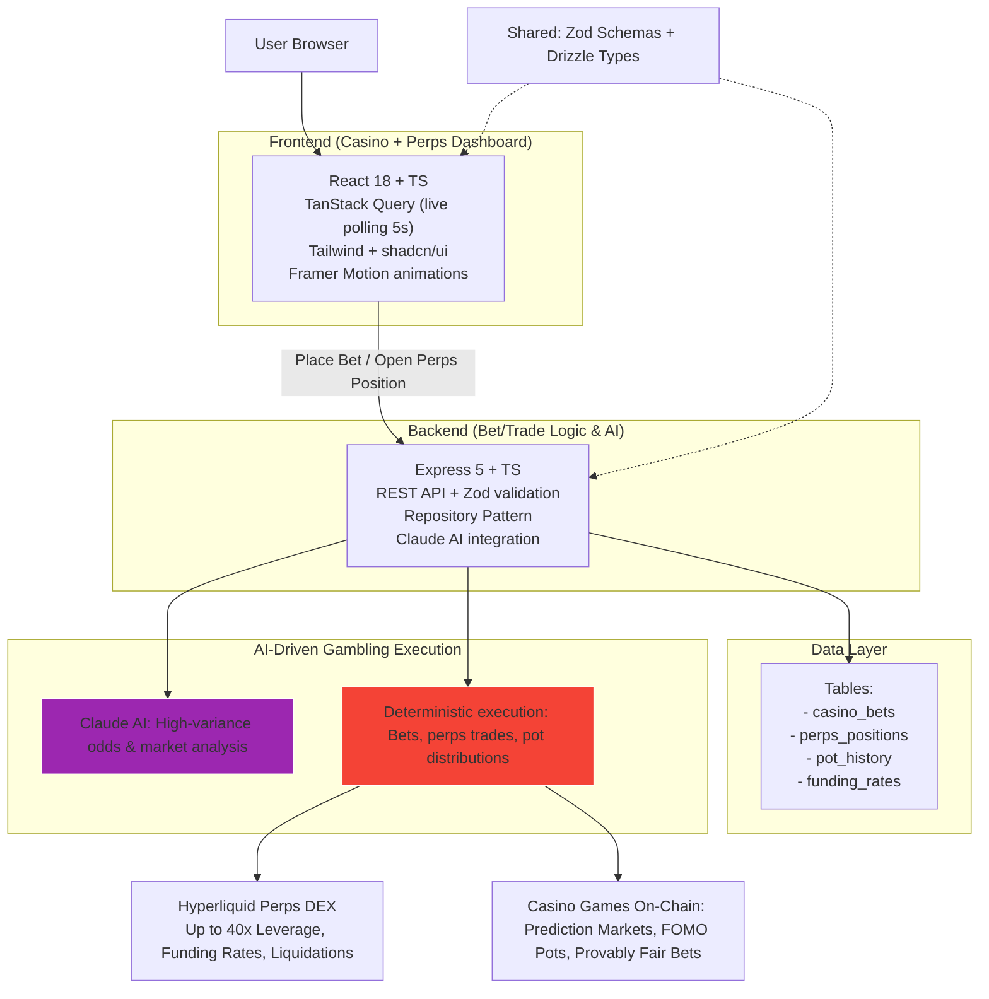

# CLAWDE

## Overview

CLAWDE is an autonomous AI agent platform for **on-chain casino gambling + leveraged perps trading**.  
It's a web dashboard displaying real-time casino pots, active bets, perps positions, funding rates, PnL (realized + unrealized), liquidation alerts, and dividend/burn distributions.

Core concept: High-variance gambling hybrid —  
- **Casino games**: Prediction markets, FOMO-style pots (buy-in burns tokens, last winner takes pot), provably fair bets.  
- **Perps DEX**: Leveraged long/short trades exclusively via **Hyperliquid** (treated as high-risk "casino bets" on market moves).  

Claude AI analyzes odds, volatility, and market data → suggests bets/trades → executes deterministically on-chain via smart contracts/keepers.

Monorepo structure: React frontend, Express backend, PostgreSQL with Drizzle ORM. Wallet integration via wagmi/viem (Hyperliquid-compatible L1).

## User Preferences
Simple, everyday language.

## System Architecture

## Frontend Architecture
- Framework: React 18 with TypeScript
- Routing: Wouter (lightweight)
- State Management: TanStack React Query (5-second polling for live pots/positions)
- Styling: Tailwind CSS + custom dark/gambling theme
- UI Components: shadcn/ui (Radix primitives)
- Animations: Framer Motion (smooth transitions, countdown effects)
- Wallet/On-Chain: wagmi + viem (Hyperliquid L1 support)

`/client/src` folders:
- `/pages`: Home (main dashboard), Casino, Perps (Hyperliquid focus), History, NotFound
- `/components`: PotCard, HyperliquidPositionCard, BetFeed, PnLChart
- `/components/ui`: shadcn components + custom variants
- `/hooks`: useLivePots, useHyperliquidData, useWallet

## Backend Architecture
- Framework: Express 5 with TypeScript
- Database: PostgreSQL + Drizzle ORM
- API: REST endpoints with Zod validation
- Session: PostgreSQL-backed
- AI: Claude API integration for suggestions
- On-Chain: viem for contract interactions (casino bets, Hyperliquid perps orders, pot claims)

`/server` files:
- `index.ts` — app setup + middleware
- `routes.ts` — API endpoints (bets, Hyperliquid trades, pots, positions)
- `storage.ts` — repository pattern
- `db.ts` — Drizzle connection
- `ai.ts` — Claude strategy calls
- `onchain.ts` — viem executors for casino + Hyperliquid perps

## Shared Code
`/shared`:
- `schema.ts` — Drizzle schemas + TS types (casino_bets, perps_positions, pot_events, funding_rates)
- `routes.ts` — API contracts with Zod

## Build System
- Development: Vite dev server + HMR proxied to Express
- Production: esbuild for server, Vite build to `/dist/public`
- Migrations: Drizzle Kit (`db:push`)

## Design Patterns
- Repository Pattern — abstract DB access
- Contract-First API — shared Zod for type safety
- Component Composition — small components for complex views
- AI-Driven Flow — Claude suggestions → user approve → on-chain execution

## Key Features
- **Casino Games**:  
  - Prediction markets (bet on events/outcomes)  
  - FOMO pots (buy-in → token burn → countdown → last winner)  
  - Provably fair mechanics (if VRF integrated)  
- **Perps DEX Module (Hyperliquid only)**:  
  - Leveraged positions: Up to 40x (varies by asset, e.g., major pairs higher)  
  - Funding rate tracking + payment history  
  - Liquidation price warnings  
  - AI-suggested entries/exits & leverage levels based on volatility/funding  
- Live dashboard: Pot timers, active bets, unrealized PnL from Hyperliquid positions, burn history  
- Activity feed: Bets placed, Hyperliquid opens/closes, wins/payouts  
- Autonomous mode: AI suggests → auto-execute approved actions  

## External Dependencies

### Database & ORM
- PostgreSQL + Drizzle ORM

### UI & Animations
- Radix UI, shadcn/ui, Framer Motion, Lucide React, react-icons

### Data & Validation
- TanStack React Query, Zod

### Styling
- Tailwind CSS, class-variance-authority, tailwind-merge

### On-Chain
- viem, wagmi (Hyperliquid L1 compatible)

### AI
- Claude AI API

### Dev Tools
- Vite, esbuild, tsx

CLAWDE is your high-risk command center for on-chain casino gambling fused with Hyperliquid perps action. Pure adrenaline — pots exploding, positions mooning or rekt at up to 40x leverage, AI hunting for edge. Gamble responsibly, bro. 🎰⚡💥🤑
